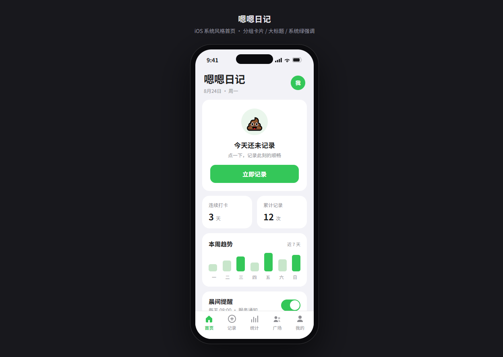
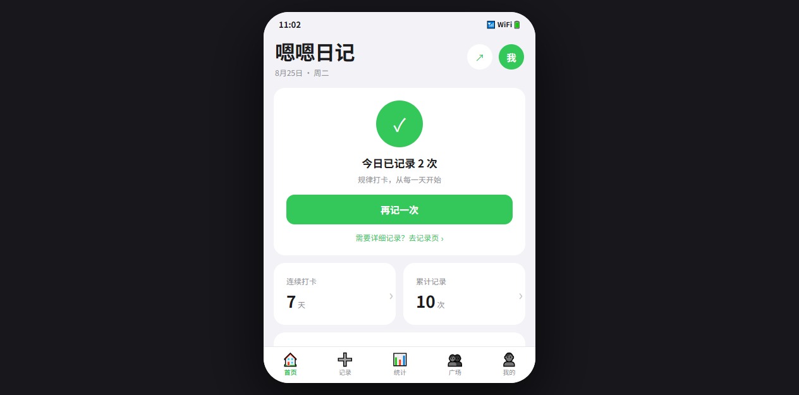
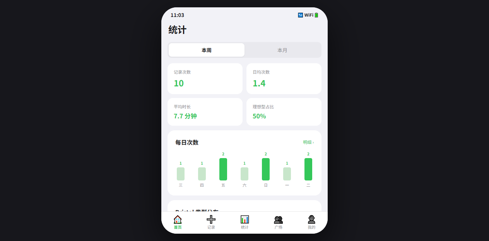
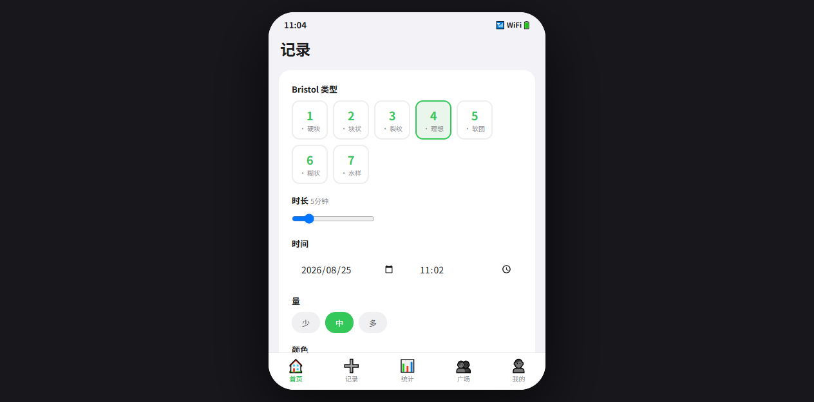

# 💩 嗯嗯日记 Shit Diary

> 一款轻松、幽默、可视化的排便健康记录微信小程序。用游戏化 + 社交化降低健康记录的门槛，把"尴尬话题"变成"可分享的健康习惯"。



## 🚀 零安装预览：浏览器交互版

如果你的设备无法安装「微信开发者工具」，可以直接在**浏览器**里体验全部 8 个页面的完整交互：

- 打开 [`docs/preview.html`](docs/preview.html)（**双击即可在浏览器运行**）
- 手机/电脑浏览器均自适应（桌面端居中显示手机框，移动端全屏）
- 演示数据预置 7 天，**立即记录 / 详细记录 / 删除 / 提醒开关 / 资料编辑**全部可交互
- 数据保存在 `localStorage`，刷新页面会保留（可点击"我的 → 重置演示数据"恢复初始）

截图预览：  

> 本预览版为"UI/交互验收"用途，不含真实云函数调用、订阅消息、真机扫码等能力。真机预览/发布仍需微信开发者工具（见下方正式运行步骤）。

## ✨ 项目特色

- 🍃 **iOS 系统风格** — System Grouped 卡片、大标题导航、系统绿强调色
- 📝 **Bristol 量表** — 1–7 型专业分类，含时长、症状、颜色多维度记录
- 📊 **可视化统计** — 周/月趋势、热力图、周报自动生成
- 🔔 **提醒召回** — 订阅消息 + 智能推荐提醒时间
- 💬 **社交裂变** — 专属肠道报告分享、好友 PK 排行
- 🔐 **合规优先** — 选"工具"类目，文案用"记录/参考"避免医疗资质

## 🛠 技术栈

| 层 | 选型 |
|---|---|
| 框架 | 原生微信小程序 |
| 后端 | 微信云开发（云函数 + 云数据库 + 云存储 + 云调用）|
| UI | 自定义 iOS 风格（System Grouped）|
| 图表 | 原生 Canvas2D（零依赖，`utils/chart.js`，小程序与预览版同源）|
| 时间 | dayjs（计划中）|

## 📂 目录结构

```
poop-diary-miniprogram/
├── app.js / app.json / app.wxss          # 全局配置
├── pages/
│   ├── index/                            # iOS 风格首页（完整交互）
│   ├── record/                           # 记录表单
│   ├── history/                          # 历史明细（筛选/删除）
│   ├── stats/                            # 统计可视化（周/月切换）
│   ├── remind/                           # 提醒设置（订阅消息）
│   ├── community/                        # 广场（分享/排行榜预告）
│   ├── profile/                          # 我的（资料/菜单）
│   └── guide/                            # 新手引导（Bristol/FAQ）
├── subpackages/                          # 分包（社区/工具）
├── components/                           # 自定义组件
├── cloudfunctions/
│   ├── login/                            # 登录初始化
│   └── addRecord/                        # 新增记录
├── utils/cloud.js                        # 云函数封装
├── docs/
│   ├── home-preview.png                  # 首页效果截图
│   ├── home-preview.html                 # 预览源文件（可独立打开）
│   └── CLOUD_SETUP.md                    # 云开发环境初始化指南
└── ARCHITECTURE.md                       # 完整架构设计文档
```

## 🚀 快速开始

### 1. 准备
- 微信开发者工具（最新版）
- 已注册的小程序 AppID
- 开通**微信云开发**（免费版即可开发）

### 2. 导入项目
1. 用微信开发者工具打开本目录
2. 填入你的 AppID（修改 `project.config.json` 中的 `appid`）
3. 工具栏 → 云开发 → 创建新环境

### 3. 配置云开发
> 详细步骤见 [docs/CLOUD_SETUP.md](docs/CLOUD_SETUP.md)

简要：
1. 创建云环境，**复制环境 ID**
2. 在 `app.js` 中把 `globalData.env` 替换为你的环境 ID
3. 创建数据库集合：`users` / `records` / `reminders` / `community_posts`
4. 右键 `cloudfunctions/login`、`cloudfunctions/addRecord` → **上传并部署：云端安装依赖**

### 4. 编译预览
点击编译，即可在模拟器中预览首页。

## 📐 数据模型（核心 `records`）

| 字段 | 类型 | 说明 |
|---|---|---|
| `_openid` | string | 所属用户 |
| `date` / `time` | string | 发生日期与时间 |
| `timestamp` | number | 毫秒时间戳（排序/聚合） |
| `durationSec` | number | 时长（秒），0–3600 |
| `bristolType` | number | **1–7**（Bristol 量表，必填） |
| `color` | string | 颜色枚举 |
| `symptomTags` | array | 症状标签 |
| `note` | string | 备注（≤200） |
| `createdAt` | date | 服务端时间 |

完整数据模型与索引建议见 [ARCHITECTURE.md](ARCHITECTURE.md)。

## 🎨 设计语言

| 元素 | 颜色 / 值 |
|---|---|
| 页面底 | `#F2F2F7`（iOS systemGroupedBackground）|
| 卡片 | `#FFFFFF`，圆角 `36rpx` |
| 强调 | `#34C759`（iOS systemGreen）|
| 文字 | `#1C1C1E`（主）/ `#8E8E93`（次）|
| 字体 | `-apple-system / PingFang SC` |
| 导航栏 | 白底黑字，tabBar 选中 `#34C759` |

## 🗓 路线图

- [x] MVP 架构与首页 iOS 风格
- [x] 记录页 + 云函数
- [x] 统计可视化（Canvas 真实图表：每日次数折线/面积图 + Bristol 类型环形图，零依赖）
- [ ] 提醒订阅 + 服务通知（TMPL_IDS 待填）
- [ ] 分享卡片 + 裂变归因（小程序码 `scene` 归因）
- [ ] 社区排行（分包）
- [ ] 肠道周报 + 趣味测试

## ⚖️ 合规与免责声明

- 类目选「工具/生活服务」，不申请医疗资质
- 文案统一用"记录/参考/趋势"，禁用"诊断/治疗/用药"
- 隐私指引 + `msgSecCheck` 内容安全审核
- **免责声明**：数据仅供参考，不构成医疗建议

## 📄 License

MIT
